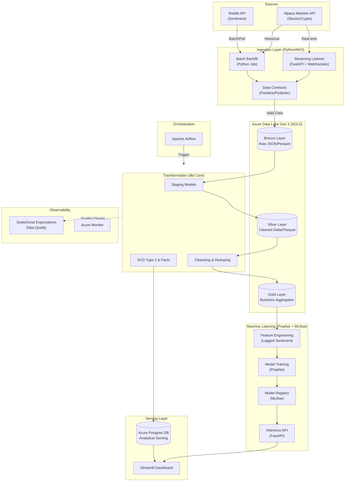

# Fintech Data Engine: High-Frequency Market & Sentiment Analysis Platform

## Overview
**Fintech Data Engine** is a professional-grade Data Engineering platform designed to ingest, process, and analyze high-frequency market data alongside social sentiment signals. It mimics a real-world Fintech data platform, solving "Day 2" problems like data contracts, schema evolution, and infrastructure security.

## Architecture



The platform follows the **Medallion Architecture** (Lakehouse pattern):

1.  **Bronze (Raw)**: Immutable, append-only raw data from Alpaca (Market) and Reddit (Sentiment).
2.  **Silver (Refined)**: Deduped, validated, and enriched data.
3.  **Gold (Curated)**: Business-level aggregates (e.g., "Daily Sentiment Impact on Volatility") modeled in a Star Schema and served via **Azure Postgres**.

## Tech Stack
-   **Cloud**: Azure (ADLS Gen 2, AKS, Postgres, Key Vault, VNet)
-   **IaC**: Terraform (Modularized)
-   **Ingestion**: Python (FastAPI for WebSockets, AsyncIO for Batch)
-   **Transformation**: dbt Core (SCD Type 2, Incremental Models)
-   **Machine Learning**: Prophet (Forecasting), MLflow (Tracking), Scikit-Learn
-   **Orchestration**: Apache Airflow
-   **Visualization**: Streamlit, Plotly
-   **Quality**: Soda / Great Expectations

## Key Features
-   **Hybrid Ingestion**: Handles both real-time WebSocket streams (Trade updates) and batch historical backfills.
-   **ML Forecasting**: Predicts future stock volatility based on historical price and sentiment signals.
-   **Data Contracts**: Enforces schema validity at the edge (before data hits the lake).
-   **Security**: All infrastructure provisioned within a VNet with Private Endpoints; secrets managed by Key Vault.
-   **Idempotency**: Pipelines designed to be re-runnable without data duplication.

## Project Structure
```bash
fintech-data-engine/
├── dbt/                    # dbt Core project
│   ├── models/             # SQL Models (Staging, Marts)
│   └── dbt_project.yml     # dbt Configuration
├── infra/                  # Terraform Infrastructure
│   ├── modules/            # Reusable Modules (ADLS, Postgres, VNet)
├── src/                    # Python Source Code
│   ├── ingestion/          # Ingestion Scripts (Batch & Streaming)
│   ├── ml/                 # Machine Learning (Prophet, Training, Inference)
│   └── dashboard/          # Streamlit Dashboard
├── architecture.mmd        # Mermaid Architecture Diagram
├── data_quality.md         # Data Contracts & Quality Framework
├── tradeoffs.md            # Senior-level Architectural Decisions
├── IMPLEMENTATION_GUIDE.md # Detailed Step-by-Step Guide
└── requirements.txt        # Python Dependencies
```

## How to Run (Simulation)

### 1. Infrastructure (Terraform)
```bash
cd infra
# terraform init
# terraform plan
# terraform apply
```

### 2. Ingestion (Python)
**Prerequisites**: `pip install -r requirements.txt`

**Run Batch Backfill**:
```bash
python src/ingestion/batch_backfill.py
# Outputs Parquet files to local 'raw_data/bronze/market/...' simulating ADLS
```

**Run Streaming Listener**:
```bash
uvicorn src.ingestion.stream_listener:app --reload
# Send data via WebSocket to localhost:8000/ws/market-data
```

### 3. Transformation (dbt)
```bash
cd dbt
# dbt deps
# dbt build
```

### 4. Machine Learning
```bash
# Feature Engineering (Fetch Real Data)
python src/ml/feature_engineering.py

# Train Model
python src/ml/train_forecast.py

# Run Inference Demo
python src/ml/demo_inference.py
```

### 5. Dashboard
```bash
streamlit run src/dashboard/app.py
```

